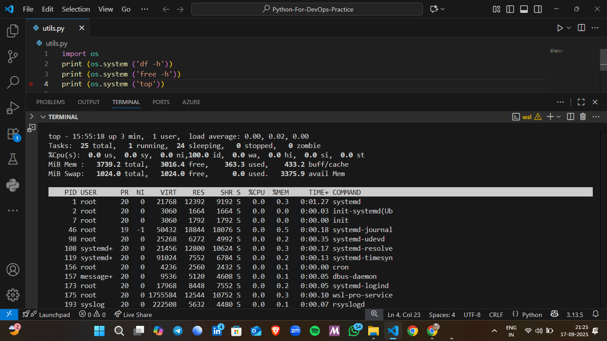
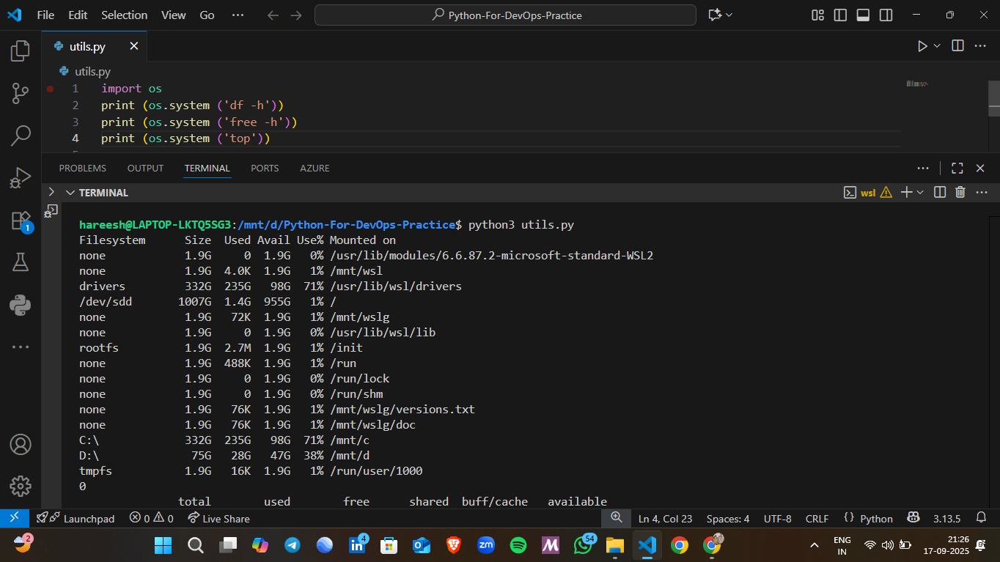

# 📦 Automated Backup & System Info Scripts

This project contains **two Python-based utilities** for DevOps practice:

1. **Backup Script** → Creates compressed `.tar.gz` backups of your chosen directory.  
2. **System Info Script** → Prints system resource usage (disk, memory, CPU).

---

## 🚀 Features
- 📦 **Backup Script**
  - Automatically generates a compressed backup (`.tar.gz`).
  - Uses current date for backup naming (e.g., `backup_2025-09-21.tar.gz`).
  - Lightweight and works on **Linux / WSL **.
  - Built with only the Python standard library (`os`, `shutil`, `datetime`).

- 🖥 **System Info Script**
  - Runs Linux commands:
    - `df -h` → Shows disk usage
    - `free -h` → Shows memory usage
    - `top` → Displays running processes
  - Helps monitor system performance quickly.

---



## ⚙️ Usage

### 🔹 Backup Script
Clone the repository and run the script:

```bash
git clone https://github.com/<your-username>/devops-scripts.git
cd devops-scripts
python3 utils.py
```

A backup file will be generated inside your chosen **destination folder**.

### 🔹 System Info Script
Run the system info script:

```bash
python3 system_info.py
```

This will print output from `df -h`, `free -h`, and `top`.

---

## 🧾  Outputs

### Backup Script
```
backup_2025-09-21.tar.gz
```

### System Info Script
```
Filesystem      Size  Used Avail Use% Mounted on
...
Mem:           3.7Gi  359Mi  2.9Gi ...
Tasks:  29 total,   1 running,  28 sleeping ...
```

---

## 📂  Structure
```
devops-scripts/
│── utils.py          # Backup script
│── system_info.py    # System monitoring script
│── README.md         # Project documentation
```

---

## 🔗 Connect with Me

[](https://www.linkedin.com/in/hareesh-kumar-02045a339/)

---

## 🤝 Contributions
Feel free to **fork** this project, suggest improvements, or use it as a base for your own automation workflows 🚀.

---

## 📜 License
This project is licensed under the **MIT License**.
